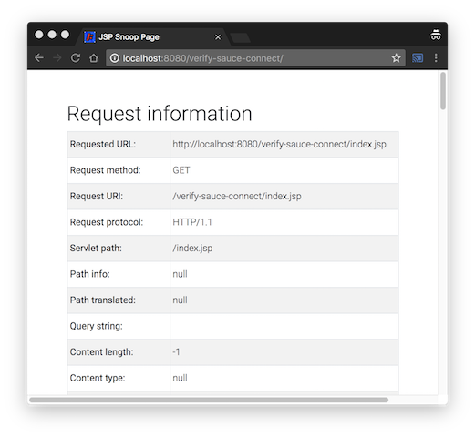

# Verify Sauce Connect

This sample project can be used as a starting point for testing connectivity from the Sauce Labs cloud to your private network via Sauce Connect.

## Getting Started

### Prerequisites

Follow the instructions located at https://wiki.saucelabs.com/display/DOCS/Basic+Sauce+Connect+Proxy+Setup.  Most importantly, this link will provide instruction for:

 * Whitelisting the appropriate IP address ranges for the Sauce Cloud,
 * Downloading the most current release of Sauce Connect.
 
Once the IP white lists are put in place and Sauce Connect is downloaded, proceed to the next section.  

### Start Sauce Connect for accessing Desktop VMs, Emulators and Simulators

This section walks you through the steps to start the Sauce Connect proxy for connections to Desktop VMs, Emulators, and Simulators.  Real Device access requires a separate method for starting Sauce Connect described in the next section.
    
1. Start the Sauce Connect proxy for Desktop VMs, Emulators, and Simulators

    To start the Sauce Connect proxy, use the following command:

    ```
    $ sc --user=${SAUCE_USERNAME} --api-key=${SAUCE_ACCESS_KEY} --tunnel-identifier mytunnel1
    ```

    where:
    
    * `${SAUCE_USERNAME}` is the username (or email address) used to sign into the Sauce Labs dashboard at https://saucelabs.com.
    * `${SAUCE_ACCESS_KEY}` is the access key.  This can be found by signing into https://saucelabs.com, clicking on your user name in the top right corner, selecting __My Account__.  The __Access Key__ is found about half way down the web page,
    * `mytunnel1` is a user-friendly name to give the tunnel.

2. Wait for Sauce Connect to completely start

    The Sauce Connect start up will be complete when you see `Sauce Connect is up, you may start your tests.` in the output:

    ```
    $ sc --user=${SAUCE_USERNAME} --api-key=${SAUCE_ACCESS_KEY} --tunnel-identifier mytunnel1
    5 Mar 13:10:49 - Sauce Connect 4.4.12, build 3905 74cd761 -dirty
    5 Mar 13:10:49 - Using CA certificate bundle /etc/ssl/certs/ca-bundle.crt.
    5 Mar 13:10:49 - Using CA certificate verify path /etc/ssl/certs.
    5 Mar 13:10:49 - Starting up; pid 6199
    5 Mar 13:10:49 - Command line arguments: sc ...
    5 Mar 13:10:49 - Log file: /tmp/sc.log
    5 Mar 13:10:49 - Pid file: /tmp/sc_client.pid
    5 Mar 13:10:49 - Timezone: CST GMT offset: -6h
    5 Mar 13:10:49 - Using no proxy for connecting to Sauce Labs REST API.
    5 Mar 13:10:54 - Started scproxy on port 38195.
    5 Mar 13:10:54 - Please wait for 'you may start your tests' to start your tests.
    5 Mar 13:11:16 - Secure remote tunnel VM provisioned.
    5 Mar 13:11:16 - Tunnel ID: 105bb7fcf311480791289f85186b1d01
    5 Mar 13:11:16 - Using no proxy for connecting to tunnel VM.
    5 Mar 13:11:16 - Starting Selenium listener...
    5 Mar 13:11:16 - Establishing secure TLS connection to tunnel...
    5 Mar 13:11:16 - Selenium listener started on port 4445.
    5 Mar 13:11:17 - Sauce Connect is up, you may start your tests.
    ```     

### Start Sauce Connect for accessing Real Devices (mobile)

This section walks you through the steps to start the Sauce Connect proxy for connections to the Real Device cloud.

1. Start the Sauce Connect proxy for Real Device (mobile):

    To start the Sauce Connect proxy, use the following command:

    ```
    $ sc --user=${RDC_USERNAME} --api-key=${RDC_SAUCE_CONNECT_API_KEY} --tunnel-identifier ${RDC_TUNNEL_ID} --rest-url=https://us1.api.testobject.com/sc/rest/v1
    ```

    where:
    
    * `${RDC_USERNAME}` is the username (or email address) used to sign into the TestObject dashboard at https://app.testobject.com.
    * `${RDC_SAUCE_CONNECT_API_KEY}` is the access key.  This can be found by signing into https://app.testobject.com, clicking on __Account__ in the top right corner, selecting __Account Settings__ &rarr; __Sauce Connect__.  Copy the __API Key__ value,
    * `mytunnel1` is a user-friendly name to give the tunnel.

    NOTE: The __${RDC_SAUCE_CONNECT_API_KEY}__ is the __API Key__ used by the __Sauce Connect__ proxy.  It is **not** the same API Key used by your applications.

2. Accept the Sauce Connect disclaimer

    As one-time task, you must accept the __Sauce Connect for Public Cloud__ disclaimer found under the __SAUCE CONNECT__ tab of your __Account Settings__.  To do so, sign into https://app.testobject.com, click on __Account__ in the top right corner, selecting __Account Settings__ &rarr; __Sauce Connect__.  At the bottom of the screen, you will to click the __Enable Sauce Connect for Public Cloud__ button.

3. Wait for Sauce Connect to completely start

    The Sauce Connect start up will be complete when you see `Sauce Connect is up, you may start your tests.` in the output:

    ```
    $ sc --user=${RDC_USERNAME} --api-key=${RDC_SAUCE_CONNECT_API_KEY} --tunnel-identifier ${RDC_TUNNEL_ID} --rest-url=https://us1.api.testobject.com/sc/rest/v1
    3 Jul 09:07:19 - Sauce Connect 4.4.12, build 3905 74cd761 -n -dirty
    3 Jul 09:07:19 - Using CA certificate verify path /etc/ssl/certs.
    3 Jul 09:07:19 - Starting up; pid 11674
    3 Jul 09:07:19 - Command line arguments: ./sc ...
    3 Jul 09:07:19 - Log file: /var/folders/xn/6l1n3sqj3ylcvwbjftq_yrt00000gn/T/sc-my-rdc-tunnel.log
    3 Jul 09:07:19 - Pid file: /tmp/sc_client-my-rdc-tunnel.pid
    3 Jul 09:07:19 - Timezone: CDT GMT offset: -5h
    3 Jul 09:07:19 - Using no proxy for connecting to Sauce Labs REST API.
    3 Jul 09:07:19 - Error in checkUpdate: error querying from https://us1.api.testobject.com/versions.json, error was: <html><body><h1>503 Service Unavailable</h1>
    No server is available to handle this request.
    </body></html>
    . HTTP status: 503 Service Unavailable
    3 Jul 09:07:19 - Started scproxy on port 49383.
    3 Jul 09:07:19 - Please wait for 'you may start your tests' to start your tests.
    3 Jul 09:07:25 - Secure remote tunnel VM provisioned.
    3 Jul 09:07:25 - Tunnel ID: 174c348f-83fa-4d11-bb82-04c2e51096f5
    3 Jul 09:07:25 - Using no proxy for connecting to tunnel VM.
    3 Jul 09:07:25 - Starting Selenium listener...
    3 Jul 09:07:25 - Establishing secure TLS connection to tunnel...
    3 Jul 09:07:25 - Selenium listener started on port 4445.
    3 Jul 09:07:35 - Sauce Connect is up, you may start your tests.
    ```    

    NOTE: The error `Error in checkUpdate: error querying from https://us1.api.testobject.com/versions.json ...` can be ignored and will be removed from the next release of Sauce Connect.

### Verify Connectivity with a Sample Web App and Live Testing

This git repo contains a sample web application that can be used to verify connectivity from the device under test on the Sauce Cloud to your private network where the Sauce Connect proxy is running.

To verify Sauce Connect using this sample web app, follow these steps:

1. Package the sample web app into a .war file:

        $ mvn clean install -DskipTests=true
 
2. Start the include sample website that will be used to test connectivity from Sauce Labs to this network segment:

        $ mvn org.codehaus.cargo:cargo-maven2-plugin:run

3. Verify Connectivity.

    * To verify connectivity from Desktop VMs, Emulators, and Simulators, sign into https://saucelabs.com and start a **Live Testing** session.  

    * To verify connectivity from the Real Device cloud, sign into https://app.testobject.com, create a Web-based Mobile App supplying the URL of the hostname you wish test and start a **Live Testing** session.
        NOTE: Be sure to select your tunnel instance in the __Sauce Connect Tunnel__ dropdown.

4. Navigate to your hostname and this specific URI:

    ```
        http://<yourhostname>:8080/verify-sauce-connect
    ```
    
    

### Verify Connectivity with a Sample Web App and Automated Testing

To enable your test suite to use the Sauce Connect tunnel instance, a capability named `tunnelIdentifier` needs to be added to your Desired Capabilities specifying the tunnel identifier specifyed when starting the tunnel.  In the example above, we specifed a tunnel ID of `mytunnel1`.

Here's an example from the test suite included in this git repo: 

```Java
    capabilities.setCapability("tunnelIdentifier", sauceTunnelId);
```

See `src/test/java/com/saucelabs/example/VerifySauceConnectTest.java` for more details.

#### Executing the automated test suite

Our test suite requires a few inputs so it can a) know the tunnel ID we want to use and b) know the hostname and port number of the internal host where our sample web site is running.  We can supply these to the test suite via the following environment variables:

* SAUCE_TUNNEL_ID - The tunnel ID we wish to use.  In these example, we've been using `mytunnel1`
* INTERNAL_TEST_HOST - Specify the hostname where our sample maven project is downloaded and running in step 2 above.  Defaults to `localhost`
* INTERNAL_TEST_PORT - The port our sample website is listening on.  Defaults to `8080`

Once these environment variables are set, we can execute our test suite:

The sample test suite can be executed with:

```
    $ mvn test
```

```
[INFO] Scanning for projects...
[INFO]
[INFO] ------------------------------------------------------------------------
[INFO] Building Verify Sauce Connect Utility 1.0.0
[INFO] ------------------------------------------------------------------------
[INFO]
[INFO] --- maven-resources-plugin:2.6:resources (default-resources) @ verify-sauce-connect ---
[WARNING] Using platform encoding (UTF-8 actually) to copy filtered resources, i.e. build is platform dependent!
[INFO] skip non existing resourceDirectory /Volumes/Duo1/github/billmeyer/verify-sauce-connect/src/main/resources
[INFO]
[INFO] --- maven-compiler-plugin:3.6.1:compile (default-compile) @ verify-sauce-connect ---
[INFO] Nothing to compile - all classes are up to date
[INFO]
[INFO] --- maven-resources-plugin:2.6:testResources (default-testResources) @ verify-sauce-connect ---
[WARNING] Using platform encoding (UTF-8 actually) to copy filtered resources, i.e. build is platform dependent!
[INFO] skip non existing resourceDirectory /Volumes/Duo1/github/billmeyer/verify-sauce-connect/src/test/resources
[INFO]
[INFO] --- maven-compiler-plugin:3.6.1:testCompile (default-testCompile) @ verify-sauce-connect ---
[INFO] Nothing to compile - all classes are up to date
[INFO]
[INFO] --- maven-surefire-plugin:2.20.1:test (default-test) @ verify-sauce-connect ---
[INFO]
[INFO] -------------------------------------------------------
[INFO]  T E S T S
[INFO] -------------------------------------------------------
[INFO] Running com.saucelabs.example.VerifySauceConnectTest
Jun 26, 2018 2:35:57 PM org.openqa.selenium.remote.ProtocolHandshake createSession
INFO: Detected dialect: OSS
[main][String] Tue Jun 26 14:35:57 CDT 2018SauceOnDemandSessionID=f54578acd72d43c9aca4c2492a6d7a63
We successfully accessed our internal test page!
[INFO] Tests run: 1, Failures: 0, Errors: 0, Skipped: 0, Time elapsed: 25.428 s - in com.saucelabs.example.VerifySauceConnectTest
[INFO]
[INFO] Results:
[INFO]
[INFO] Tests run: 1, Failures: 0, Errors: 0, Skipped: 0
[INFO]
[INFO] ------------------------------------------------------------------------
[INFO] BUILD SUCCESS
[INFO] ------------------------------------------------------------------------
[INFO] Total time: 27.057 s
[INFO] Finished at: 2018-06-26T14:36:02-05:00
[INFO] Final Memory: 19M/773M
[INFO] ------------------------------------------------------------------------
```
